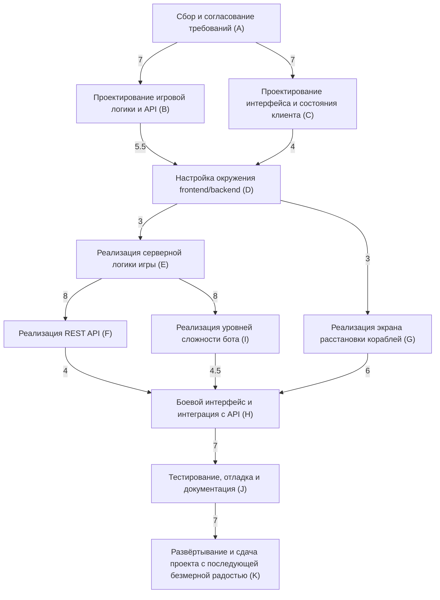

## Расчёт общего времени проекта SeaBattle с использованием формулы PERT

Формула оценки времени в PERT:

`te = (to + 4tm + tp) / 6`

где:
- `to` = оптимистичная оценка
- `tm` = наиболее вероятная оценка
- `tp` = пессимистичная оценка

Определение оценок для задач

| Задача | Описание | $t_o$ | $t_m$ | $t_p$ | Расчёт $t_e$ |
|--------|----------|-------|-------|-------|--------------|
| A | Сбор и согласование требований | 5 | 7 | 10 | (5 + 4*7 + 10)/6 = **7.17** |
| B | Проектирование игровой логики и API | 4 | 5.5 | 8 | (4 + 4*5.5 + 8)/6 = **5.67** |
| C | Проектирование интерфейса и состояния клиента | 3 | 4 | 6 | (3 + 4*4 + 6)/6 = **4.17** |
| D | Настройка окружения frontend/backend | 2 | 3 | 5 | (2 + 4*3 + 5)/6 = **3.17** |
| E | Реализация серверной логики игры | 6 | 8 | 12 | (6 + 4*8 + 12)/6 = **8.33** |
| F | Реализация REST API | 3 | 4 | 6 | (3 + 4*4 + 6)/6 = **4.17** |
| G | Реализация экрана расстановки кораблей | 4 | 6 | 9 | (4 + 4*6 + 9)/6 = **6.17** |
| H | Реализация боевого интерфейса и интеграции с API | 5 | 7 | 10 | (5 + 4*7 + 10)/6 = **7.17** |
| I | Реализация уровней сложности бота | 3 | 4.5 | 7 | (3 + 4*4.5 + 7)/6 = **4.67** |
| J | Тестирование, отладка и документация | 5 | 7 | 11 | (5 + 4*7 + 11)/6 = **7.33** |
| K | Развёртывание и сдача проекта с последующей безмерной радостью | 3 | 4 | 6 | (3 + 4*4 + 6)/6 = **4.17** |

Критический путь (максимальная длительность):
**A → B → D → E → I → H → J → K**

### Расчёт общего времени
`7.17 + 5.67 + 3.17 + 8.33 + 4.67 + 7.17 + 7.33 + 4.17 = 47.68 дней`

Рекомендуемый буфер: +15% (≈ 7 дней) → **55 дней**
